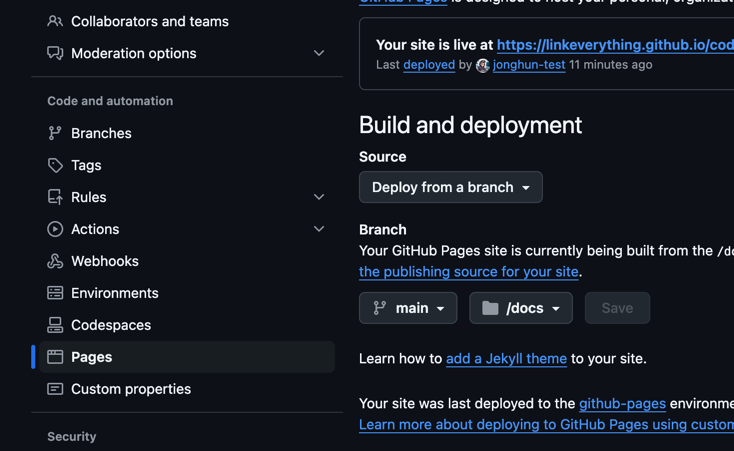

summary: How to create a codelab in Github pages
id: 20241203-how-to-codelab
categories: Codelab, github pages
status: Published

# How to make a Codelab in Github Pages

## Introduction
This codelab describe the process that making codelab page in Github pages.

## Pre-requisites
In local machine, `brew` should be installed.

## Step 1: Install `go` and `claat`

Install `go`:
```shell
brew install go
```

Add `go` binary to `PATH`:
```shell
echo 'export PATH=$PATH:~/go/bin' >> ~/.zshrc
```
```shell
source ~/.zshrc
```

Then , install `claat`:
```shell
go install github.com/googlecodelabs/tools/claat@latest
```

## Step 2: create a markdown `.md` file

Make a markdown file(`sample.md`) like:

```markdown
summary: Title of the Codelab
id: codelab-id
categories: Web, Beginner
status: Published

# Title of the Codelab

## Introduction
Brief introduction of the blog/tutorial.

## Step 1: Do Something
Instructions for step 1.

## Step 2: Do Something Else
Instructions for step 2.
```

## Step 3: export the markdown file

In the same directory with markdown file:

```shell
claat export sample.md
```

claat create a `codelab-id` directory in the same path. (id based directory.)

Positive
: When using images in markdown file, those are included in img folder in exported directory.

## Step 4: push to github pages

Copy the `codelab-id` directory to the github repo's `docs` folder.

Then, in the settings in the respository, enable pages as below:



## Step 5: Check in the browser

Finally, we can check the codelab in:
```text
https://<username>.github.io/<repo>/codelab-id/
```